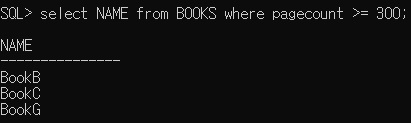

# 1. 프로젝트 목표 및 문제 정의

주어진 도서관련 ER 다이어그램에 맞는 데이터베이스를 설계하고, 입력 데이터를 바탕으로 속성별 타입과 제약을 설정한다. 먼저, ER-win을 이용하여 모드 별로 설계하고, 이를 바탕으로 실제 데이터 베이스 서버와 연동한 후 스키마를 생성한다. 주어진 문제에 대한 질의를 SQL문으로 작성하여 그에 따른 결과를 확인한다.


# 2. ER 다이어그램


주어진 데이터베이스 설계의 ER 다이어그램은 위와 같다. ER 다이어그램의 Entity는 TYPES, AUTHORS, BOOKS, STUDENTS, BORROWS로 구성된다. 각 entity는 attribute를 가지며 Relationship으로 연결되어 있다. 

- TYPES
  - typeid를 PK로 가지고 있다.
  - name을 attribute로 갖는다.
- AUTHORS
  - authorid를 PK로 가지고 있다.
  - name을 attribute로 갖는다.
- BOOKS
  - bookid를 PK로 가지고 있다.
  - authorid와 typeid를 FK로 갖는다.
  - TYPES entity와 AUTHORS entity와 non-identifying한 relationship을 갖는다. 
  - TYPES와 맺는 relationship의 이름을 type_of라고 하고, AUTHORS와 맺는 relationship의 이름을 written_by로 하였으나, 이를 별도의 entity로 생성하지는 않았다.
  - BORROWS entity와 1:1 relationship을 맺으며, zero or one cardinality를 갖는다. 
  - name, pagecount를 attribute로 갖는다.
- STUDENTS
  - BORROWS entity와 1:N relationship을 맺으며, zero, one or more cardinality를 갖는다.
  - studentid를 PK로 갖는다.
  - name, gender, class를 attribute로 갖는다.
- BORROWS
  - STUDENTS entity와 BOOKS entity와의 관계를 설명하는 사건(대출하다) entity이다.
  - borrowid, bookid, student를 PK로 가지고 있다.


# 3 . Physical Mode


## 3-1 Domain

- CHAR
  - 대부분의 attribute를 char 자료형으로 설정하였다.
  - maximum 크기만 다르게 조정하였다. 
    - 각 entity의 id를 나타내는 attribute의 경우에 maximum 길이를 10으로 하였다.
    - 이름(name)을 나타내는 attribute의 경우에 maximum 길이를 15로 설정하였다.
- INTEGER
  - BOOKS entity의 pageout attribute를 integer 자료형으로 설정하였다.
  - 책의 page 수를 나타내는 속성이므로 0 이상의 값이 할당되어야 한다는 constraint를 주었다.
- DATE
  - BORROWS entity의 dateOut, returned attribute를 DATE 자료형으로 설정하였다.
  - SQL은 date형과 관련된 편리한 연산들을 지원하며, (ex> 2021-03-02 > 2021-02-28) 이를 활용할 수 있다.
- Gender (사용자 정의 domain)
  - gender attribute의 경우, 해당 attribute에 할당될 수 있는 값으로 M, F 외에는 없다는 가정을 할 수 있다.
  - 따라서, 관련 validation constraint를 적용한 domain을 새롭게 정의 하였고, 상세 내용은 아래 3-2에서 설명한다.


## 3-2 사용된 Validation Constraint

(1) Gender validation rule


해당 validation rule이 적용된 attribute는 M 혹은 F 두가지 종류의 값만 가질 수 있다.


(2) Pageout validation rule


해당 validatio rule이 적용된 attribute는 0 이상의 integer 값만을 가질 수 있다.


## 3-3 TYPES

책의 유형을 나타내는 entity set이다. 


- Attribute
  - typeid : TYPES entity의 primary key이다. NOT NULL로 설정되어 있다.
  - name :  maximum 길이 15의 제약을 가진 char형 변수이다. NOT NULL로 설정하였다.

- Relationship
  - 유형 하나에 여러 권의 책이 속할 수 있다는 가정 하에 AUTHORS entity와 BOOKS entity가  1:N relationship을 맺도록 설정하였다.
  - 유형이 없는 책은 없다는 가정을 하였고, AUTHORS entity와 BOOKS entity가 one or more cardinality이다.
  - TYPES entity와 BOOKS entity의 관계를 non-identifying하게 설정하였고, BOOKS entity의 하나의 attribute로 TYPES entity의 PK가 자리한다.


## 3-4 AUTHORS

책의 저자를 나타내는 entity set이다.


- Attribute
  - authorid : AUTHORS entity의 primary key이다. NOT NULL로 설정되어 있다.
  - name :  maximum 길이 15의 제약을 가진 char형 변수이다. NOT NULL로 설정하였다.
- Relationship
  - 저자 한 명이 여러 권의 책을 쓸 수 있다는 가정 하에 TYPES entity와 BOOKS entity가 1:N relationship을 맺도록 설정하였다.
  - 저자가 없는 책은 없다는 가정을 하였고, TYPES entity는 BOOKS entity와 one or more cardinality이다.
  - AUTHORS entity와 BOOKS entity의 관계를 non-identifying하게 설정하였고, BOOKS entity의 하나의 attribute로 AUTHORS entity의 PK가 자리한다.


## 3-5 BOOKS

책을 나타내는 entity set이다.


- Attribute
  - bookid : BOOKS entity의 primary key이다. NOT NULL로 설정되어 있다.
  - name :  maximum 길이 15의 제약을 가진 char형 변수이다. NOT NULL로 설정하였다.
  - pageout :  0 이상의 값만을 허락하는 constraint를 가지는 integer형 변수이다. NOT NULL로 설정하였다.
  - authorid : TYPES entity의 PK가 BOOKS entity 하나의 attribute로 자리한다. (non - identifying)
  -  typeid : AUTHORS entity의 PK가 BOOKS entity 하나의 attribute로 자리한다. (non - identifying)
- Relationship
  - 저자 한 명이 여러 권의 책을 쓸 수 있다는 가정 하에 TYPES entity와 BOOKS entity가 1:N relationship을 맺도록 설정하였다.
  - 저자가 없는 책은 없다는 가정을 하였고, TYPES entity는 BOOKS entity와 one or more cardinality이다.
  - 유형 하나에 여러 권의 책이 속할 수 있다는 가정 하에 AUTHORS entity와 BOOKS entity가  1:N relationship을 맺도록 설정하였다.
  - 유형이 없는 책은 없다는 가정을 하였고, AUTHORS entity와 BOOKS entity가 one or more cardinality이다.
  - 책은 borrow 사건을 1회 이상 발생시킬 수 없다고 가정하고, BORROWS entity와 BOOKS entity가 1:1 relationship을 맺도록 설정하였다.
  - 책 한권에 borrow라는 사건이 발생하지 않을 수도 있다는 가정을 하여, BOOKS entity와 BORROWS entity는 zero or one cardinality이다.


## 3-6 STUDENTS

학생을 나타내는 entity set이다.


- Attribute
  - studentid : STUDENTS entity의 primary key이다. NOT NULL로 설정되어 있다.
  - name :  maximum 길이 15의 제약을 가진 char형 변수이다. NOT NULL로 설정하였다.
  - gender : 3-2에서 언급한 무결성 제약을 가지는 attribute이다. NOT NULL로 설정되어 있으며, maximum 길이를 6으로 설정하였다. attribute의 값을 나타내는데 있어 maximum 길이는 1이면 충분하지만, sql 상에서 gender라는 attribute명이 잘 보이도록 6으로 설정하였다. NOT NULL로 설정하되었다.
  - class : maximum 길이 5의 제약을 가진 char형 변수이다. NOT NULL로 설정하였다.
- Relationship
  - 학생 하나가 여러 권의 책을 빌릴 수 있다는 가정 하에 STUDENTS entity와 BORROWS entity가 1:N relationship을 맺도록 설정하였다.
  - 학생이 책을 빌리지 않을 수도 있다는 가정하에, STUDENTS entity는 BORROWSS entity와 zero, one or more cardinality이다.
  - STUDENTS entity와 BORROWS entity의 관계를 identifying하게 설정하였고, BORROWS entity의 PK 중 하나로 STUDENTS entity의 PK가 자리한다.


## 3-7 BORROWS

빌리는 사건을 나타내는 entity set이다.


- Attribute
  - borrowid : BORROWS entity의 primary key이다. NOT NULL로 설정되어 있다.
  - bookid, studentid : STUDENTS entity, BOOKS entity와 identifying한 관계를 맺으면서, 각 entity set의 PK가 BORROWS의 PK로 자리하였다.
  - dateOut : DATE형 변수이다. dateOut 속성이 없는 schema는 있을 수 없다는 가정하에 NOT NULL로 설정하였다.
  - returned : DATE형 변수이다. returned되지 않은 책이 있을 수 있다는 가정하에  NULL로 설정하였다.
- Relationship
  - 학생 하나가 여러 권의 책을 빌릴 수 있다는 가정 하에 STUDENTS entity와 BORROWS entity가 1:N relationship을 맺도록 설정하였다.
  - 학생이 책을 빌리지 않을 수도 있다는 가정하에, STUDENTS entity는 BORROWSS entity와 zero, one or more cardinality이다.
  - 책은 borrow 사건을 1회 이상 발생시킬 수 없다고 가정하고, BORROWS entity와 BOOKS entity가 1:1 relationship을 맺도록 설정하였다.
  - 책 한권에 borrow라는 사건이 발생하지 않을 수도 있다는 가정을 하여, BOOKS entity와 BORROWS entity는 zero or one cardinality이다.


# 4. SQL 질의문 및 결과

(1) 다음 데이터를 입력하시오 (insert) – select문을 이용해 모든 데이터가 제대로 입력되어 있는지를 보여야 함.

- TYPES

```sql
insert into TYPES (TYPEID, NAME) values ('T1', 'Drama');
insert into TYPES (TYPEID, NAME) values ('T2', 'Science');
insert into TYPES (TYPEID, NAME) values ('T3', 'History');
select * from TYPES;
```

결과 )


- AUTHORS

```sql
insert into AUTHORS (AUTHORID, NAME) values ('A1', 'W.Blake');
insert into AUTHORS (AUTHORID, NAME) values ('A2', 'A.Christie');
insert into AUTHORS (AUTHORID, NAME) values ('A3', 'W.Shakespeare');
select * from AUTHORS;
```

결과 )


- BOOKS

```sql
insert into BOOKS (BOOKID, NAME, PAGECOUNT, AUTHORID, TYPEID) values ('B-101', 'BookA', 298, 'A1', 'T1');
insert into BOOKS (BOOKID, NAME, PAGECOUNT, AUTHORID, TYPEID) values ('B-102', 'BookB', 321, 'A2', 'T1');
insert into BOOKS (BOOKID, NAME, PAGECOUNT, AUTHORID, TYPEID) values ('B-103', 'BookC', 367, 'A1', 'T2');
insert into BOOKS (BOOKID, NAME, PAGECOUNT, AUTHORID, TYPEID) values ('B-104', 'BookD', 293, 'A3', 'T3');
insert into BOOKS (BOOKID, NAME, PAGECOUNT, AUTHORID, TYPEID) values ('B-105', 'BookE', 222, 'A2', 'T2');
insert into BOOKS (BOOKID, NAME, PAGECOUNT, AUTHORID, TYPEID) values ('B-106', 'BookF', 223, 'A3', 'T1');
insert into BOOKS (BOOKID, NAME, PAGECOUNT, AUTHORID, TYPEID) values ('B-107', 'BookG', 362, 'A1', 'T3');
select * from BOOKS;
```

결과 )


- STUDENTS

```sql
insert into STUDENTS (STUDENTID, NAME, GENDER, CLASS) values ('S1', 'Adams', 'M', 'C1');
insert into STUDENTS (STUDENTID, NAME, GENDER, CLASS) values ('S2', 'Brooks', 'F', 'C2');
insert into STUDENTS (STUDENTID, NAME, GENDER, CLASS) values ('S3', 'Curry', 'M', 'C3');
insert into STUDENTS (STUDENTID, NAME, GENDER, CLASS) values ('S4', 'Glenn', 'M', 'C4');
insert into STUDENTS (STUDENTID, NAME, GENDER, CLASS) values ('S5', 'Green', 'F', 'C1');
insert into STUDENTS (STUDENTID, NAME, GENDER, CLASS) values ('S6', 'Hayes', 'M', 'C4');
insert into STUDENTS (STUDENTID, NAME, GENDER, CLASS) values ('S7', 'Johnson', 'F', 'C3');
insert into STUDENTS (STUDENTID, NAME, GENDER, CLASS) values ('S8', 'Jones', 'M', 'C2');
insert into STUDENTS (STUDENTID, NAME, GENDER, CLASS) values ('S9', 'Lindsay', 'F', 'C2');
insert into STUDENTS (STUDENTID, NAME, GENDER, CLASS) values ('S10', 'Smith', 'M', 'C4');
insert into STUDENTS (STUDENTID, NAME, GENDER, CLASS) values ('S11', 'Turner', 'F', 'C1');
insert into STUDENTS (STUDENTID, NAME, GENDER, CLASS) values ('S12', 'Williams', 'F', 'C4');
select * from STUDENTS;
```

결과 )


- BORROWS

```sql
insert into BORROWS (BORROWID, BOOKID, STUDENTID, DATEOUT, RETURNED) values ('L-301', 'B-101', 'S7', '2021-02-08', '2021-02-10');
insert into BORROWS (BORROWID, BOOKID, STUDENTID, DATEOUT, RETURNED) values ('L-302', 'B-102', 'S2', '2021-03-01', '2021-03-15');
insert into BORROWS (BORROWID, BOOKID, STUDENTID, DATEOUT, RETURNED) values ('L-303', 'B-107', 'S2', '2021-05-17', '2021-05-23');
insert into BORROWS (BORROWID, BOOKID, STUDENTID, DATEOUT, RETURNED) values ('L-304', 'B-105', 'S1', '2021-02-21', '2021-03-14');
insert into BORROWS (BORROWID, BOOKID, STUDENTID, DATEOUT, RETURNED) values ('L-305', 'B-103', 'S11', '2021-02-08', '2021-02-26');
insert into BORROWS (BORROWID, BOOKID, STUDENTID, DATEOUT, RETURNED) values ('L-306', 'B-101', 'S1', '2021-02-28', '2021-03-21');
insert into BORROWS (BORROWID, BOOKID, STUDENTID, DATEOUT, RETURNED) values ('L-307', 'B-104', 'S10', '2021-02-15', '2021-03-01');
insert into BORROWS (BORROWID, BOOKID, STUDENTID, DATEOUT, RETURNED) values ('L-308', 'B-101', 'S3', '2021-04-13', '2021-04-15');
insert into BORROWS (BORROWID, BOOKID, STUDENTID, DATEOUT, RETURNED) values ('L-309', 'B-104', 'S7', '2021-04-15', '2021-04-21');
insert into BORROWS (BORROWID, BOOKID, STUDENTID, DATEOUT, RETURNED) values ('L-310', 'B-103', 'S6', '2021-05-01', '2021-05-09');
select * from BORROWS;
```

결과 )


(2) 페이지 수(pagecount)가 300 이상인 모든 책의 이름을 나열하라.

```sql
select NAME from BOOKS where pagecount <= 300;
```

결과 )




(3) 페이지 수(pagecount)가 200 이상 250 미만인 모든 책의 이름을 나열하라.

```sql
select NAME from BOOKS where pagecount >= 200 and pagecount < 250;
```

결과 )


(4) 반(class)이 C1반이거나 C2반인 모든 여학생의 이름을 나열하라.

```sql
select NAME from STUDENTS where gender = 'F' and (class = 'C1' or class = 'C2');
```

결과 )


(5) 페이지 수(pagecount)가 가장 큰 책의 이름을 찾아라.

```sql
select NAME from BOOKS where pagecount=(select max(pagecount) from BOOKS);
```

결과 )


(6) 페이지 수(pagecount)의 내림차순으로 책의 이름을 나열하라. (책 이름, pagecount 쌍으로 나타낼 것.)

```sql
select name, pagecount from BOOKS order by pagecount desc;
```

결과 )


(7) 반(class) 별로 학생 수를 구하라. (반, 학생 수 쌍으로 나열할 것.)

```sql
select class, count(studentid) as cnt from STUDENTS group by class;
```

결과 )


(8) 반(class) 별로 남학생의 수를 구하라. (반, 학생 수 쌍으로 나열할 것.)

```sql
select class, count(*) from STUDENTS where gender='M' group by class;
```

결과 )


(9) 책을 빌려간 모든 학생들의 이름과 그 학생들이 빌려간 책의 이름을 나열하라. (학생 이름, 책 이름의 쌍으로 나열할 것.)

```sql
select STUDENTS.name, BOOKS.name
from STUDENTS, BOOKS, BORROWS
where STUDENTS.studentid=BORROWS.studentid
and BORROWS.bookid=BOOKS.bookid;
```

결과 )


(10) C1반의 학생이 빌려간 모든 책의 이름을 나열하라. (중복은 제거할 것.)

```sql
select distinct name 
from ((select bookid 
from ((select studentid
from STUDENTS where class='C1') 
natural join BORROWS)) 
natural join BOOKS);
```

결과 )


(11) C1반의 학생 별로 책을 읽은 횟수를 나열하라. (학생 이름, 횟수의 쌍으로 나열할 것.)

```sql
create view C1_INFO as
select * from STUDENTS where STUDENTS.class='C1';
select name, count(bookid) as num_of_read
from BORROWS right join C1_INFO on BORROWS.studentid = C1_INFO.studentid
group by name;
drop view C1_INFO;
```

결과 )


(12) C1 또는 C2반의 학생 중에 2021-02-15 ~ 2021-03-16 기간동안 책을 대여(dateOut)해간 학생의 이름을 나열하라.

```sql
select distinct name 
from (select * from BORROWS where dateout >= '2021-02-15' and dateout <= '2021-03-16') 
natural join (select * from STUDENTS where class='C1' or class='C2');
```

결과 )


(13) 'Brooks'라는 학생이 읽은 책의 이름을 나열하라.

```sql
select name
from (select * from ((select studentid from STUDENTS where name='Brooks') natural join BORROWS)) 
natural join BOOKS;
```

결과 )


(14) 가장 많은 책을 쓴 작가의 이름을 찾아라. 2명 이상이면 모두 나열하라.

```sql
select name
from ((select authorid from BOOKS group by authorid having count(*)=
(select max(count(*)) from BOOKS group by authorid))
natural join AUTHORS);
```

결과 )


(15) 가장 많은 페이지 수를 지닌 책을 읽은 학생의 이름을 나열하라.

```sql
select name 
from ((select studentid 
from ((select bookid 
from BOOKS where pagecount= (select max(pagecount) from BOOKS)) 
natural join BORROWS)) 
natural join STUDENTS);
```

결과 )


(16) 가장 많은 책을 쓴 작가들의 책을 읽은 학생의 이름을 나열하라.

```sql
select name
from ((select studentid
from ((select bookid
from ((select authorid from BOOKS group by authorid having count(*)=
(select max(count(*)) from BOOKS group by authorid))
natural join BOOKS))
natural join BORROWS))
natural join STUDENTS);
```

결과 )


