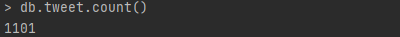
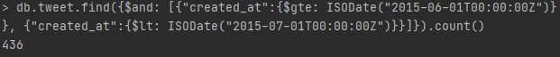
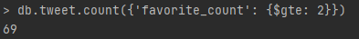
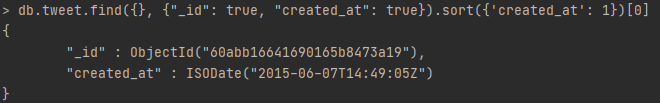

# 1. MongoDB 질의문 및 결과

1) 전체 트윗의 개수를 구하시오.

2) retweet된 트윗의 개수를 구하시오.

3) 좋아요(favorite_count)가 2 이상인 트윗의 개수를 구하시오.

4) 전체 트윗을 날짜 별로 정렬해서 가장 빠른 날짜의 트윗을 출력하시오. (ObjectId와 날짜만 출력할 것.)

5) 2015년 6월 1일부터 2015년 6월 30일까지 6월 1달 동안 실린 tweet의 개수를 구하시오.(6월 30일에 올라온 트윗도 포함.)

# 2. RDB vs NoSQL DB에 대한 비교

|      | RDB                                                          | NoSQL                                                        |
| ---- | ------------------------------------------------------------ | ------------------------------------------------------------ |
| 장점 | - 정규화된 데이터 모델 - 데이터 무결성/ 정합성 보장 - 작은 크기의 트랜잭션 | - Web 환경의 다양한 정보 검색 및 저장                        |
| 단점 | - 확장성의 한계 - 클라우드 분산환경 부적합              | - 데이터 무결성 / 정합성 보장 못함                           |
| 특징 | - join을 통해 정보연계 가능 - 트랜잭션의 안정성 확보를 위한 ACID 지원 - 정형적인 스키마 구조 | - 데이터의 수정 / 삭제가 거의 없고, 대개 INSERT 위주 - 강한 consistency 불필요 - 노드 추가 / 삭제, 데이터 분산에 유연 |

## RDB

- RDB는 Relational Database의 약자로 관계형 데이터베이스이다. 관계를 기반으로 한 DB 개체의 내부 관계가 아닌 외부의 관계를 적용한 것으로 테이블과 테이블 사이의 관계가 맺어지는 형태로 설계한다. 데이터 타입과 제약을 통해 데이터의 정확성을 보장한다. RDB의 성능을 높이거나 확장하는데는 비용이 많이 든다. 대표적인 예로는 MySql, Oracle, PostgreSql 가 있다. 

## NoSQL

- RDB에서의 확장성 문제를 해결하고자 하는 시도로 개발된 데이터베이스 모델이다. 클라우드 분산환경에 적합하며, 이를 통해 저렴한 비용으로 DB성능을 개선하고, 확장할 수 있다. 확장성을 위해 가장 많이 활용하는 방식은 key-value 방식이다. 구조 변경이 용이하고, 데이터 형식을 다양하게 설정할 수 있다. 정확성 보다는 데이터의 양이 중요한 빅데이터 실시간 데이터를 관리하는 데 주로 활용된다. 안전성을 다소 희생하고, 확장성을 지향한 데이터베이스 모델이므로, 금융이나 결제, 회원정보 관리에는 부적합하다고 할 수 있다. Memory mapped file이고, 파일 엔진 DB로서 메모리 관리를 OS가 담당하게 된다. (MongoDB의 경우에는 문서형 데이터 베이스이다.) 메모리의 성능이 NoSQL의 성능을 결정하는 커다란 요인이 된다. 대표적인 예로는 mongoDB, hBase 등이 있다.

## NoSQL과 텍스트마이닝

- 텍스트 마이닝을 수행하기 위해서 NoSQL을 사용하는 것이 RDB를 사용하는 것보다 더 적절하다고 할 수 있다. 텍스트 마이닝은 비정형 데이터 마이닝의 유형 중 하나로 자연어 처리 기술과 문서 처리 기술을 적용하여 유용한 정보를 추출, 가공하는 것을 목적으로 하는 기술이다. 이 raw한 데이터는 의미있는 형태로 가공하는 작업이 필수적이며, 데이터에 대한 구조 변경이 용이하고 데이터의 형식을 다양하게 바꾸기 쉬운 것은 데이터베이스 모델은 NoSQL이다. 정형화되어 있지 않고 다양성의 여지가 큰 데이터를 relation 관계를 정의하는 관점에서 접근하는 RDB의 모델은 적절하지 않을 수 있다. 
- 해당 프로젝트는 1101개의 트윗에 대해 tweet의 내용 중 의미있는 형태소만을 추출하고, 이 형태소를 분석하여 문서간의 유사도 등을 얻어내는 것을 목적으로 한다. 이는 raw한 데이터를 자유롭게 가공할 수 있어야 한다는 의미이며, 이러한 유연함은 RDB 데이터베이스 모델이 아닌 NoSQL 데이터베이스 모델의 특성이다. tweet의 내용은 미리 정의된 데이터 모델을 특정하기 곤란한 면이 있고, 미리 정의된 방식으로 데이터가 들어오지 않을 수도 있다. 더불어 다루는 데이터의 양이 억단위로 늘어나게 된다면, NoSQL의 장점인 '확장성'은 반드시 고려해야 하는 요소가 된다.